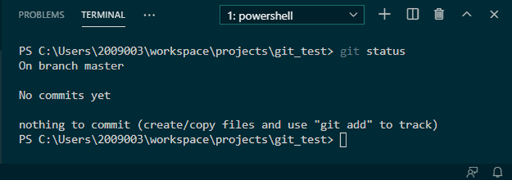
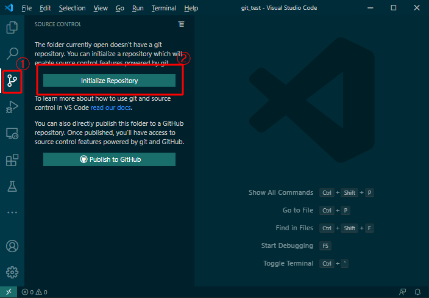
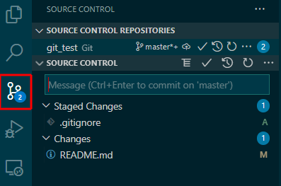
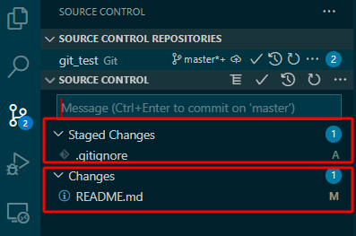
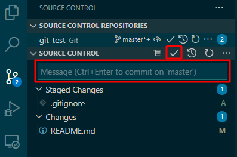
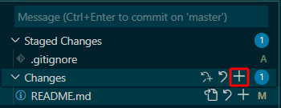
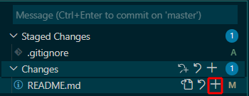
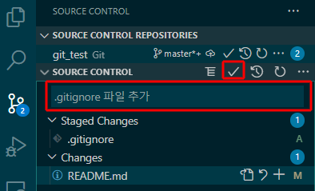

# GIT 사용법

## 1. git 기본용어

### (1) 저장소(Repository)
	프로젝트에 포함된 .git/ 폴더를 Repository(저장소)라고 부름  
	Repository에는 브랜치 정보, 커밋 이력, 원격 저장소 정보등 git 기능 사용을 위한 정보가 저장됨  

### (2) 작업 폴더(Working Directory)
	실제 프로젝트 디렉토리  
	프로젝트 디렉토리에서 .git 폴더를 제외한 모든 영역을 의미함


### (3) 인덱스 / 스테이징(Index / Staging)
	프로젝트의 변경사항이 Repository에 반영되기 전 저장되는 준비 영역  
	파일의 상태를 기록하며, Index에 기록하는 것을 Staging(스테이징) 한다고 표현  
	Staging(스테이징)을 위한 명령어는 git add  
	.git/index 파일로 관리됨

### (4) 스태시(Stash)
	Working directory/Repository/Index에 포함되지 않는 임시 저장 영역  
	작업 내용을 임시로 저장하고 필요할 때 불러올 수 있음   

### (5) 브랜치(Branch)
	Repository에 존재하는 독립된 작업공간  
	Git 저장소 초기화시 master branch가 기본적으로 생성됨  
	이후 작업 절차에 따라 branch를 생성, 병합 및 삭제 가능  

### (6) 병합(Merge)
	서로 다른 branch를 하나의 branch로 병합  

## 2. 많이 사용하는 명령어

- git config  **
    - git사용을 위한 환경설정용 명령어
    - 기본적으로 user.name과 user.email을 설정해주어야함
    - git으 환경설정은 총 세 개의 파일에 나뉘어 저장됨  
        - C:\Program Files\Git\etc\gitconfig > 현재 컴퓨터에서 사용되는 모든 git 저장소에 적용
        - C:\Users\현재유저\\.gitconfig > 현재 유저가 사용하는 git 저장소에 적용
        - 현재프로젝트폴더\\.git\cofnig > 현재 프로젝트 저장소에 적용
``` bash
# 환경설정 값 확인
git config --system user.name # 시스템 환경설정, 유저 이름
git config --system user.email # 시스템 환경설정, 유저 이메일

git config --global user.name # 현재 사용자 환경설정, 유저 이름
git config --system user.email # 현재 사용자 환경설정, 유저 이메일

git config user.name # 현재 저장소 환경설정, 유저 이름
git config user.email # 현재 저장소 환경설정, 유저 이메일

# 환경설정 값 변경
git config user.name “User Name” # 현재 저장소 환경설정, 유저 이름 변경
git config user.email “user@egap.co.kr” # 현재 저장소 환경설정, 유저 이메일 변경
```

- git init  
    - 비어있는 새로운 저장소 생성 혹은 이미 있는 저장소 재설정
``` bash
git init [-q | --quiet] [--bare] [--template=<template_directory>]
	  [--separate-git-dir <git dir>] [--object-format=<format>]
	  [-b <branch-name> | --initial-branch=<branch-name>]
	  [--shared[=<permissions>]] [directory]

# 자주 사용되는 옵션
git init # 아무 옵션없이 주로 사용됨
```

- git status  
    - 현재 작업중인 저장소의 상태 표시  


```bash
# 사용법
# Working directory에서 다음 명령어 수행
git status
```

- git add  
    - Worktree에서 변경되거나 새로 추가된 파일을 인덱스에 추가(Staging)  

```bash
git add [--verbose | -v] [--dry-run | -n] [--force | -f] [--interactive | -i] [--patch | -p]
	  [--edit | -e] [--[no-]all | --[no-]ignore-removal | [--update | -u]]
	  [--intent-to-add | -N] [--refresh] [--ignore-errors] [--ignore-missing] [--renormalize]
	  [--chmod=(+|-)x] [--pathspec-from-file=<file> [--pathspec-file-nul]]
	  [--] [<pathspec>…]

# 주로 사용하는 옵션
git add . # 옵션 없이 현재 위치와 하위 폴더에 포함된 모든 파일을 인덱스에 추가

```

- git rm  
    - 변경사항을 Index에서 제거  

```bash
git rm [-f | --force] [-n] [-r] [--cached] [--ignore-unmatch]
	  [--quiet] [--pathspec-from-file=<file> [--pathspec-file-nul]]
	  [--] [<pathspec>…]

# 주로 사용되는 옵션
git rm ./README.md # 옵션 없이 스테이징된 파일 이름 or 경로 입력
```

- git commit  **
    - Stagin된 변경사항을 Repository(저장소)에 저장
    - 작업 후 변경사항은 모두 commit하여 저장해야함

``` bash
git commit [-a | --interactive | --patch] [-s] [-v] [-u<mode>] [--amend]
	   [--dry-run] [(-c | -C | --fixup | --squash) <commit>]
	   [-F <file> | -m <msg>] [--reset-author] [--allow-empty]
	   [--allow-empty-message] [--no-verify] [-e] [--author=<author>]
	   [--date=<date>] [--cleanup=<mode>] [--[no-]status]
	   [-i | -o] [--pathspec-from-file=<file> [--pathspec-file-nul]]
	   [-S[<keyid>]] [--] [<pathspec>…]

# 주로 사용하는 옵션
# -m 플래그는 메시지 입력 옵션
git commit -m “commit 메시지 입력” 

```

- git clone  **
    - 로컬 디렉터리에 저장소 복사
    - 주로 원격저상조(github, gitlab, etc...)에서 로컬 컴퓨터로 복사 수행

```bash
git clone [--template=<template_directory>]
	  [-l] [-s] [--no-hardlinks] [-q] [-n] [--bare] [--mirror]
	  [-o <name>] [-b <name>] [-u <upload-pack>] [--reference <repository>]
	  [--dissociate] [--separate-git-dir <git dir>]
	  [--depth <depth>] [--[no-]single-branch] [--no-tags]
	  [--recurse-submodules[=<pathspec>]] [--[no-]shallow-submodules]
	  [--[no-]remote-submodules] [--jobs <n>] [--sparse]
	  [--filter=<filter>] [--] <repository>
	  [<directory>]

# 자주 사용되는 옵션
git clone https://github.com/git/git.git # 옵션 없이 원격 Repository 주소와 함께 이용

```

- git pull  **
    - 원격 저장소에 저장된 특정 Branch의 최신 변경사항을 다운로드 및 병합
    - git fetch + git merge와 동일한 동작
    - 원격 저장소가 설정된 상태에서 사용 가능
    - git clone시 자동으로 원격 저장소가 설정됨

```bash
# 자주 사용되는 옵션
git pull origin master 
# or
git pull origin branch_name

```

- git push  **
    - 로컬 저장소에서 작업한 변경사항을 원격 저장소로 전송
    - 원격 저장소가 설정된 상태에서 사용 가능

```bash
# 자주 사용되는 옵션
git push origin master
# or
Git push origin branch_name
```

- git branch  **
    - 새로운 branch를 생성하거나 기존 branch 삭제에 이용

``` bash
# 자주 사용되는 옵션
# 로컬 branch 보기
git branch

# 로컬과 원격 branch 보기
git branch -av

# branch 생성
git branch <new_branch_name>

# branch 삭제
git branch -d <branch_name>

```

- git checkout  **
    - commit 작업내용간 이동 및 branch 변경

``` bash
# 자주 사용되는 옵션
# 원하는 로컬 branch로 이동
git checkout <branch_name>

# 원하는 원격 branch로 이동
git checkout <remote>/<branch_name>
```

## 3. VSCode Git 도구 사용법

### (1) VSCode 기본 git 도구  

- Visual Studio Code는 기본인 소스 컨트롤 도구로 git을 제공
- Visual Studio Code에서 제공하는 기본 기능만으로 git init을 포함한 대부분의 작업 가능  
    
    1) 저장소 초기화  
        - 좌측 소스 컨트롤 패널에서 비어있는 폴더를 git 저장소로 초기화 가능  
    

    2) 사용 가능한 기능
        - Working Directory에 포함된 저장소 목록
        - 소스컨트롤(변경사항 및 스테이징 상태)
    
    3) 변경사항 확인
        - 소스 컨트롤 패널 버튼에 표시되는 숫자로 변경사항 존재 여부 확인 가능
    

        - 현재 반영된 변경사항중 스테이징된 파일과 아직 스테이징되지 않은 파일 구분 가능
    

        - 스테이징된 파일 커밋 가능  
    

    4) 변경사항 스테이징
        - 모든 변경사항 스테이징  
    

        - 특정 파일 스태이징  
    

    5) 변경사항 commit  
        - commit 메시지를 필수로 작성한 후 스테이징된 내용 commit  
    

    
    ## 4. Gitflow 절차  

    (1) 저장소 clone  
    (2) git checkout develop  
    (3) git checkout -b f_브랜치_이름  
    (4) 작업 진행  
    (5) 테스트  
    (5) git push origin f_브랜치_이름  
    (6) Merge request 작성  
    (7) Merge 이후 git checkout develop 실행  
    (8) git fetch --all, git pull --all 실행  

